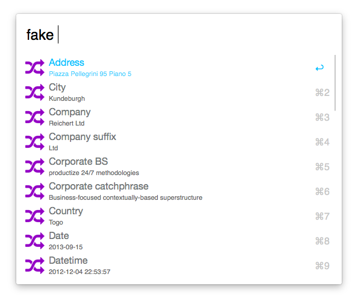
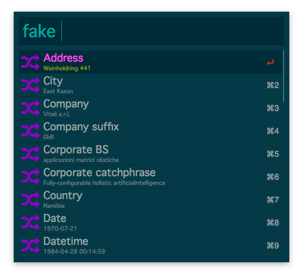
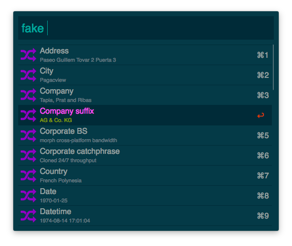
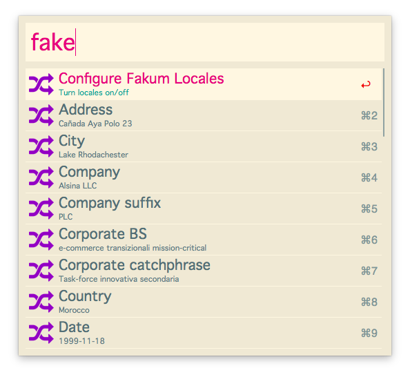
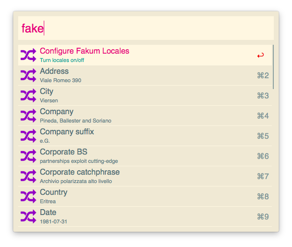

# Alfred 2 Themes #

Some themes I've made for [Alfred 2][alfred].

- [Pale](#pale)
- [Solarized Dark](#solarized-dark)
- [Solarized Dark Small](#solarized-dark-small)
- [Solarized Light](#solarized-light)
- [Solarized Light Small](#solarized-light-small)

## Pale ##

[Install in Alfred][theme-pale]

## Solarized Dark ##

[Install in Alfred][theme-solarized-dark]

## Solarized Dark Small ##

[Install in Alfred][theme-solarized-dark-small]

## Solarized Light ##

[Install in Alfred][theme-solarized-light]

## Solarized Light Small ##

[Install in Alfred][theme-solarized-light-small]

[alfred]: http://www.alfredapp.com/
[theme-pale]: alfred://theme/searchForegroundColor=rgba(0,0,0,1.00)&resultSubtextFontSize=1&searchSelectionForegroundColor=rgba(0,0,0,1.00)&separatorColor=rgba(255,255,255,1.00)&resultSelectedBackgroundColor=rgba(255,255,255,1.00)&shortcutColor=rgba(199,199,199,1.00)&scrollbarColor=rgba(199,199,199,1.00)&imageStyle=4&resultSubtextFont=Helvetica&background=rgba(255,255,255,1.00)&shortcutFontSize=2&searchFontSize=2&resultSubtextColor=rgba(105,105,105,1.00)&searchBackgroundColor=rgba(255,255,255,1.00)&name=Pale&resultTextFontSize=2&resultSelectedSubtextColor=rgba(11,196,255,0.74)&shortcutSelectedColor=rgba(11,196,255,1.00)&widthSize=2&border=rgba(9,54,66,0.00)&resultTextFont=Helvetica%20Neue&resultTextColor=rgba(114,117,118,1.00)&cornerRoundness=3&searchFont=Helvetica&searchPaddingSize=3&credits=Dean%20Jackson&searchSelectionBackgroundColor=rgba(178,215,255,1.00)&resultSelectedTextColor=rgba(8,195,255,1.00)&resultPaddingSize=2&shortcutFont=Helvetica
[theme-solarized-dark]: alfred://theme/searchForegroundColor=rgba(42,161,152,1.00)&resultSubtextFontSize=1&searchSelectionForegroundColor=rgba(0,0,0,1.00)&separatorColor=rgba(6,43,54,1.00)&resultSelectedBackgroundColor=rgba(6,43,54,0.95)&shortcutColor=rgba(147,161,161,1.00)&scrollbarColor=rgba(88,110,117,1.00)&imageStyle=4&resultSubtextFont=Geneva&background=rgba(9,54,66,0.98)&shortcutFontSize=2&searchFontSize=3&resultSubtextColor=rgba(101,123,131,1.00)&searchBackgroundColor=rgba(6,43,54,0.95)&name=Solarized%20Dark&resultTextFontSize=3&resultSelectedSubtextColor=rgba(133,153,12,1.00)&shortcutSelectedColor=rgba(203,75,21,1.00)&widthSize=2&border=rgba(9,54,66,0.00)&resultTextFont=Geneva&resultTextColor=rgba(147,161,161,1.00)&cornerRoundness=2&searchFont=Geneva&searchPaddingSize=3&credits=Dean%20Jackson&searchSelectionBackgroundColor=rgba(178,215,255,1.00)&resultSelectedTextColor=rgba(255,116,247,1.00)&resultPaddingSize=2&shortcutFont=Helvetica
[theme-solarized-dark-small]: alfred://theme/searchForegroundColor=rgba(42,161,152,1.00)&resultSubtextFontSize=1&searchSelectionForegroundColor=rgba(0,0,0,1.00)&separatorColor=rgba(6,43,54,1.00)&resultSelectedBackgroundColor=rgba(6,43,54,0.95)&shortcutColor=rgba(147,161,161,1.00)&scrollbarColor=rgba(88,110,117,1.00)&imageStyle=5&resultSubtextFont=Helvetica&background=rgba(9,54,66,0.98)&shortcutFontSize=2&searchFontSize=2&resultSubtextColor=rgba(101,123,131,1.00)&searchBackgroundColor=rgba(6,43,54,0.95)&name=Solarized%20Dark%20Small&resultTextFontSize=2&resultSelectedSubtextColor=rgba(133,153,12,1.00)&shortcutSelectedColor=rgba(203,75,21,1.00)&widthSize=2&border=rgba(9,54,66,0.00)&resultTextFont=Helvetica&resultTextColor=rgba(147,161,161,1.00)&cornerRoundness=3&searchFont=Helvetica&searchPaddingSize=3&credits=Dean%20Jackson&searchSelectionBackgroundColor=rgba(178,215,255,1.00)&resultSelectedTextColor=rgba(255,116,247,1.00)&resultPaddingSize=2&shortcutFont=Helvetica
[theme-solarized-light]: alfred://theme/searchForegroundColor=rgba(211,54,130,1.00)&resultSubtextFontSize=1&searchSelectionForegroundColor=rgba(0,0,0,1.00)&separatorColor=rgba(253,246,227,1.00)&resultSelectedBackgroundColor=rgba(253,246,227,0.97)&shortcutColor=rgba(131,148,150,1.00)&scrollbarColor=rgba(147,161,161,1.00)&imageStyle=4&resultSubtextFont=Geneva&background=rgba(238,232,213,0.97)&shortcutFontSize=2&searchFontSize=3&resultSubtextColor=rgba(101,123,131,1.00)&searchBackgroundColor=rgba(253,246,227,0.97)&name=Solarized%20Light&resultTextFontSize=3&resultSelectedSubtextColor=rgba(42,161,152,1.00)&shortcutSelectedColor=rgba(220,50,46,1.00)&widthSize=2&border=rgba(9,54,66,0.00)&resultTextFont=Geneva&resultTextColor=rgba(88,110,117,1.00)&cornerRoundness=2&searchFont=Geneva&searchPaddingSize=3&credits=Dean%20Jackson&searchSelectionBackgroundColor=rgba(178,215,255,1.00)&resultSelectedTextColor=rgba(211,54,130,1.00)&resultPaddingSize=2&shortcutFont=Helvetica
[theme-solarized-light-small]: alfred://theme/searchForegroundColor=rgba(211,54,130,1.00)&resultSubtextFontSize=1&searchSelectionForegroundColor=rgba(0,0,0,1.00)&separatorColor=rgba(253,246,227,1.00)&resultSelectedBackgroundColor=rgba(253,246,227,0.97)&shortcutColor=rgba(131,148,150,1.00)&scrollbarColor=rgba(147,161,161,1.00)&imageStyle=9&resultSubtextFont=Helvetica&background=rgba(238,232,213,0.97)&shortcutFontSize=2&searchFontSize=2&resultSubtextColor=rgba(101,123,131,1.00)&searchBackgroundColor=rgba(253,246,227,0.97)&name=Solarized%20Light%20Small&resultTextFontSize=2&resultSelectedSubtextColor=rgba(42,161,152,1.00)&shortcutSelectedColor=rgba(220,50,46,1.00)&widthSize=2&border=rgba(9,54,66,0.00)&resultTextFont=Helvetica&resultTextColor=rgba(88,110,117,1.00)&cornerRoundness=3&searchFont=Helvetica&searchPaddingSize=3&credits=Dean%20Jackson&searchSelectionBackgroundColor=rgba(178,215,255,1.00)&resultSelectedTextColor=rgba(211,54,130,1.00)&resultPaddingSize=2&shortcutFont=Helvetica
